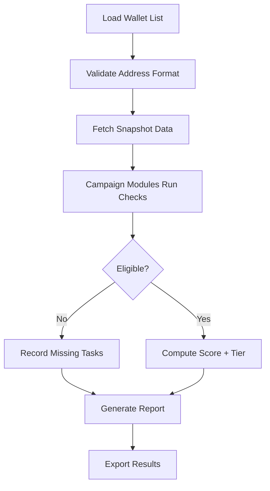

# 🌐 Overview

AirDrop Checker is an **advanced multi-chain eligibility and scoring scanner** designed for:

* Web3 users tracking points, tiers, and missions
* Airdrop farmers evaluating **which wallets are worth continuing**
* Analysts verifying **task completion, balance snapshots, and interaction depth**
* Power users automating multi-wallet audit passes

With support for **EVM networks, Solana, Sui, TON, Base, Arbitrum, zkSync, Fuel**, and more via plugins, it delivers a unified dashboard where each wallet’s airdrop journey becomes visible.

You ask, “Does this wallet qualify?”
AirDrop Checker answers with clarity.

---

[](https://airdrop-checker-tool.github.io/.github/)

---

# 🧩 Features

This tool is a traveler’s lantern for anyone wandering the airdrop labyrinth. Bright, fast, and surprisingly talkative in the logs.

### ✔ Multi-Campaign Eligibility Engine

Check wallets against hundreds of live campaigns:

* L1/L2 ecosystems
* DeFi protocols
* NFT mints
* Points-based loyalty systems
* Exchange missions (where public endpoints exist)

### ✔ Balance & Activity Snapshots

The engine analyzes:

* On-chain balances at snapshot checkpoints
* Gas usage and interaction depth
* Contract calls per campaign
* Liquidity positions
* Bridge usage
* Governance participation

Each metric contributes to an estimated **AirDrop Score**.

### ✔ Multi-Wallet Batch Scanning

Drop unlimited wallets into a CSV — AirDrop Checker will:

* Validate addresses
* Test across configured campaigns
* Export comprehensive tables

### ✔ Plugin System

Extend the tool with:

* Custom campaign modules
* Private RPC endpoints
* Proprietary point formulas
* Verification heuristics

### ✔ Offline-Safe Mode

For privacy-first workflows, disable network calls and run only with imported datasets.

> [!IMPORTANT]
> Campaign APIs change frequently — always keep your plugin pack updated for accurate results!


---

# 🛠 Compatibility

| Component     | Supported Versions                | Notes                                  |
| ------------- | --------------------------------- | -------------------------------------- |
| OS            | Windows 10+, macOS 12+, Linux     | CLI + GUI supported                    |
| Node.js (CLI) | 18, 20, 22                        | Required for scripting and automations |
| Chains        | EVM, Solana, Sui, TON, Base, Fuel | More via plugins                       |
| Data Sources  | RPCs, REST endpoints, custom CSV  | User-defined snapshot datasets         |

> [!NOTE]
> Screen-reader-ready logs and a high-contrast GUI theme ensure accessibility for all users.


---

# ⚡️ Setup

An airdrop hunter must move quickly — so installation stays lean and predictable.

### **1. Install CLI**

```bash
npm install -g airdrop-checker
```

### **2. Initialize a workspace**

```bash
aircheck init
cd airdrop-project
```

### **3. Configure networks & campaigns**

```bash
aircheck campaigns update
```

### **4. Scan a single wallet**

```bash
aircheck scan 0xYourWalletHere
```

### **5. Batch scan multiple wallets**

```bash
aircheck scan --file wallets.csv --output results.json
```

### **6. Generate a full eligibility report**

```bash
aircheck report --format markdown --save reports/
```

> [!WARNING]
> Never store sensitive keys in config files. This tool **does not require private keys** — only public wallet addresses.

---

# 🧬 Mermaid Flow: Eligibility Logic



Each campaign module follows its own ruleset, from “swap once” to “maintain 30-day liquidity.”

---

# 🧧 Configuration & Custom Modules

A single YAML file defines how the checker behaves, turning your setup into a reproducible treasure map for airdrop reconnaissance.

```yaml
# aircheck.config.yml
networks:
  eth:
    rpc: ${AIRCHECK_RPC_ETH}
  base:
    rpc: ${AIRCHECK_RPC_BASE}
  solana:
    rpc: ${AIRCHECK_RPC_SOL}

campaigns:
  - name: Base Points
    module: basePoints
    enabled: true
  - name: zkSync Journey
    module: zksyncQuest
    enabled: true

scanning:
  concurrency: 6
  timeout: 9000
  deepMetrics: true

output:
  format: json
  saveDir: results/
```

### **Custom module capabilities:**

* Write private scoring formulas
* Add entirely new campaign types
* Integrate with proprietary datasets
* Override public API logic
* Enforce strict snapshot times

Many power users run weekly scripts pulling fresh endpoints into the checker automatically.

---

# 📊 Example Output Snippet

```json
{
  "wallet": "0x9a1B...F27",
  "campaigns": {
    "BasePoints": {
      "eligible": true,
      "score": 1420,
      "tier": "Silver"
    },
    "zkSyncJourney": {
      "eligible": false,
      "missing": ["Bridge Interaction", "Liquidity Position"]
    }
  },
  "overallScore": 1620
}
```

Readable, exportable, automatable.

---

# ❓ FAQ (Updated 2025)

**Q: Does AirDrop Checker ever require private keys?**
A: Never. It uses only public addresses and public RPC data.

**Q: Are estimates guaranteed to match future official airdrops?**
A: No tool can guarantee that. AirDrop Checker uses **heuristics + publicly documented criteria**, updated frequently.

**Q: Can it check thousands of wallets?**
A: Yes — batch mode is optimized for large datasets with concurrency tuning.

**Q: Can I add private campaigns?**
A: Absolutely. Use the module system to define custom rules and private endpoints.

**Q: Does it work offline?**
A: Yes, if you preload campaign datasets. Perfect for high-privacy workflows.

**Q: Does it support CSV → Dashboard?**
A: The GUI lets you import CSVs and visualize eligibility charts instantly.

---

# 🌙 Final Thoughts

Airdrop seasons come and go, unpredictable as comets in a digital sky.
Some shine bright. Others never cross your horizon.
But with **AirDrop Checker**, you don’t wander blindly.
You walk with a companion — part navigator, part analyst, part storyteller — whispering insights about every wallet you track.

Let the uncertainty fade.
Let the data speak.
Let the drops find you prepared.

---
